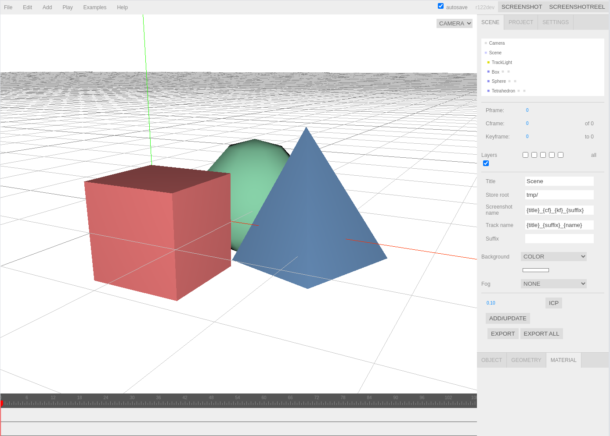

# DVIS: 3D Python visualizations

Simple performant web-based 3D visualizer interacting with python

Visualize your data with just one line of code!



## Getting started

### Install dvis package
```
pip install .
```
### Start server
```
cd server
python server.py
```
Verify you can open http://localhost:5001/

### Use client
```
import numpy as np
from dvis import dvis
dvis(np.random.rand(1000,6), s=0.03)
# sends randomly colored 1000x3 point cloud to the server
```
Verify you can see a colored point cloud

## Documentation
For an overview of available commands check out https://sirwyver.github.io/dvis_docu/

## Examples
Check out the examples in "./examples"
```
python examples/meshes.py
python examples/point_clouds.py
...
```

## Shotcuts
| Shortcut | Description               |
|----------|---------------------------|
|  **Editor**  |                           |
| w        | Translate                 |
| e        | Rotate                 |
| r        | Scale                 |
| z        | Undo                 |
| f        | Focus                 |
|  **DVIS**  |                           |
| v        | Show/hide selected object |
| 0-5      | Toggle layer 0-5          |
| Shift + 0-5      | Show layer 0-5 add.          |
| g     | Show/hide grid & axes helper          |
| n      | Next keyframe          |
| b      | Previous keyframe          |
| .      | Next frame          |
| ,      | Previous frame          |
| t      | Switch camera          |
| [      | Download screenshot         |


