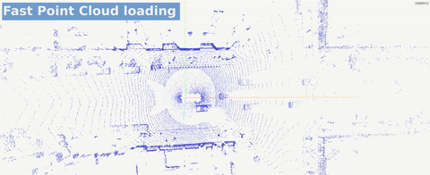
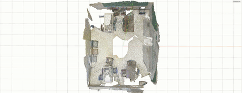
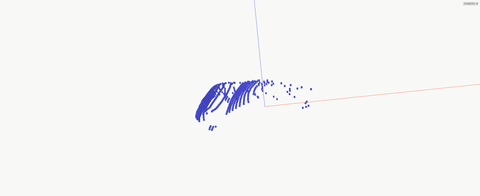
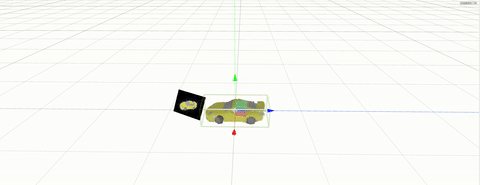

<p align="center"><a  target="_blank" rel="noopener noreferrer"></a></p>
<h1 align="center">DVIS: 3D Visualizations made easy</h1>
<h2 align="center">Visualize your data with just one line of code </h2>
<h2 align="center">Python -> Browser </h2>


<p align="center">
  
  
  
  
</p>

# 💻 Usage
```python
from dvis import dvis

dvis("mesh.obj") # load file
dvis(point_cloud, vs=0.03) # point cloud with specific voxel size
dvis(bboxes,'bbox', c=3, name='my_boxes') # show colored boxes 
dvis(np.array([0,0,0,1,2,3]), 'vec') # vector from origin to (1,2,3)
dvis(transform, 'transform') # display transformation
dvis(img, 'img') # display an image using visdom
```
Check out more examples in `./examples`
```
python examples/meshes.py
python examples/point_clouds.py
python examples/...
```


# 🚀 Getting started

Install the `dvis` package:
Via pypi:
```
pip install dvis
```
or from source:
```
git clone git@github.com:SirWyver/dvis.git
cd dvis
pip install .
```
Start the 3d web server
```
cd server
python server.py
```

Verify you can open http://localhost:5001/ and see something like this:

<p align="center">

</p>

Optionally, also start [visdom](https://github.com/fossasia/visdom) to display images/videos/charts:
```
visdom -p 4999
```
The visdom server should be accessible at http://localhost:4999/.

Try out the client
```python
import numpy as np
from dvis import dvis
dvis(np.random.rand(1000,6), s=0.03) # sends randomly colored 1000x3 point cloud to the 3d server
dvis("static/icon.png","img") # sends an image to the 2d server

```
Verify you can see a colored point cloud

# 📖  Documentation
For an overview of available commands check out the [documentation](https://sirwyver.github.io/dvis_docu/)

## Shotcuts
| Shortcut | Description               |
|----------|---------------------------|
|  **Editor**  |                           |
| w        | Translate                 |
| e        | Rotate                 |
| r        | Scale                 |
| z        | Undo                 |
| f        | Focus                 |
|  **DVIS**  |                           |
| v        | Show/hide selected object |
| 1-5      | Toggle layer 1-5          |
| 0      | Toggle all layers          |
| Shift + 0-5      | Show layer 0-5 add.          |
| g     | Show/hide grid & axes helper          |
| n      | Next keyframe          |
| b      | Previous keyframe          |
| .      | Next frame          |
| ,      | Previous frame          |
| t      | Switch camera          |
| [      | Download screenshot         |


